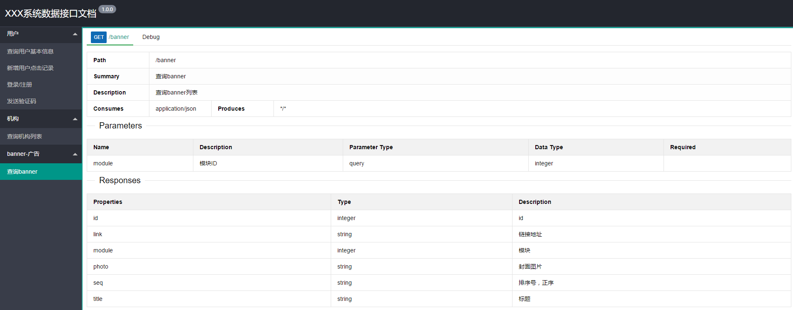
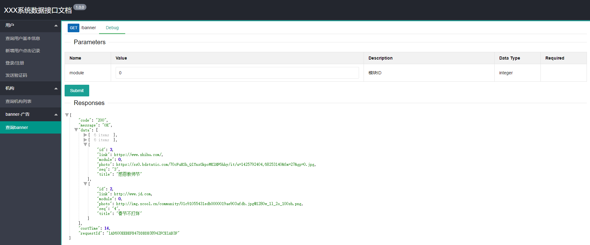

# swagger-ui-layer

------

swagger-ui-layer 是一个基于swagger的前端UI实现,是为了替换了默认的swagger-ui,让生成的文档更加友好和美观

swagger-ui-layer 要依赖swagger的注解功能，因为swagger-ui-layer 仅仅只是一个前端UI界面的实现，解析的数据来源于 `/v2/api-docs` 


### 效果

* 最终生成文档的展示例子：http://suldemo.tianox.com/docs.html

* 接口文档信息界面



* 接口文档调试界面



------

### 如何使用
##### 1、引入jar包

首先需要在你的 `pom.xml` 中引入`swagger` 和 `swagger-ui-layer` 最新版的jar包

swagger-ui-layer 最新版jar包地址：http://search.maven.org/#search%7Cgav%7C1%7Cg%3A%22com.github.caspar-chen%22%20AND%20a%3A%22swagger-ui-layer%22
```xml
<dependency>
    <groupId>io.springfox</groupId>
    <artifactId>springfox-swagger2</artifactId>
    <version>2.2.2</version>
</dependency>
<dependency>
  <groupId>com.github.caspar-chen</groupId>
  <artifactId>swagger-ui-layer</artifactId>
  <version>${last-version}</version>
</dependency>
```

##### 2、添加swagger功能和注解
启用swagger ,创建SwaggerConfig文件，内容如下，
> 需要注意的一点是 swagger api 的默认地址是`/v2/api-docs` 所以swagger-ui-layer也读取的是默认地址，
所以在new Docket()的时候不能指定group参数，否则 swagger api 的地址会在后面加入group的参数导致swagger-ui-layer不能正确请求到数据
```java
@Configuration
@EnableSwagger2
public class SwaggerConfig {

	@Bean
	public Docket ProductApi() {
		return new Docket(DocumentationType.SWAGGER_2)
				.genericModelSubstitutes(DeferredResult.class)
				.useDefaultResponseMessages(false)
				.forCodeGeneration(false)
				.pathMapping("/")
				.select()
				.build()
				.apiInfo(productApiInfo());
	}

	private ApiInfo productApiInfo() {
		ApiInfo apiInfo = new ApiInfo("XXX系统数据接口文档",
				"文档描述。。。",
				"1.0.0",
				"API TERMS URL",
				"联系人邮箱",
				"license",
				"license url");
		return apiInfo;
	}
}
```
常用的swagger注解 
Api
ApiModel
ApiModelProperty
ApiOperation
ApiParam
ApiResponse
ApiResponses
ResponseHeader
具体的注解用法可参阅互联网

##### 3、查看结果
`swagger-ui-layer` 的默认访问地址是 `http://${host}:${port}/docs.html`

### License
Apache License 2.0

### 源码维护地址
* Github ： https://github.com/caspar-chen/swagger-ui-layer
